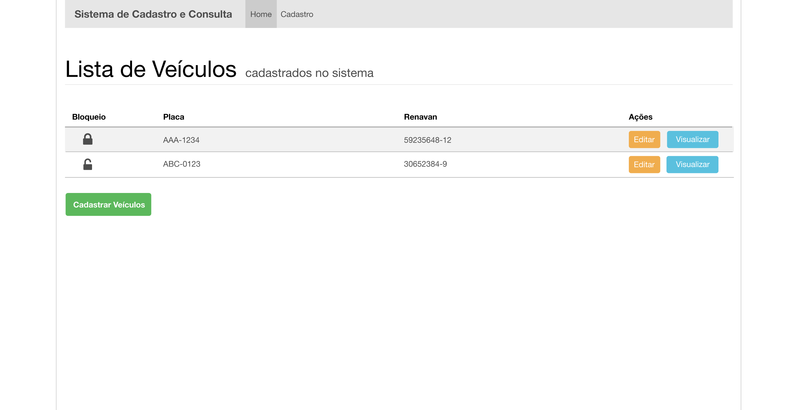
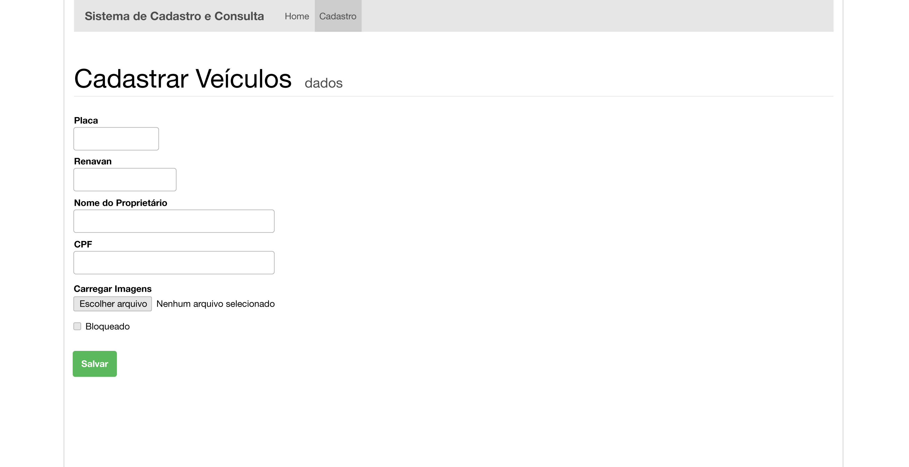
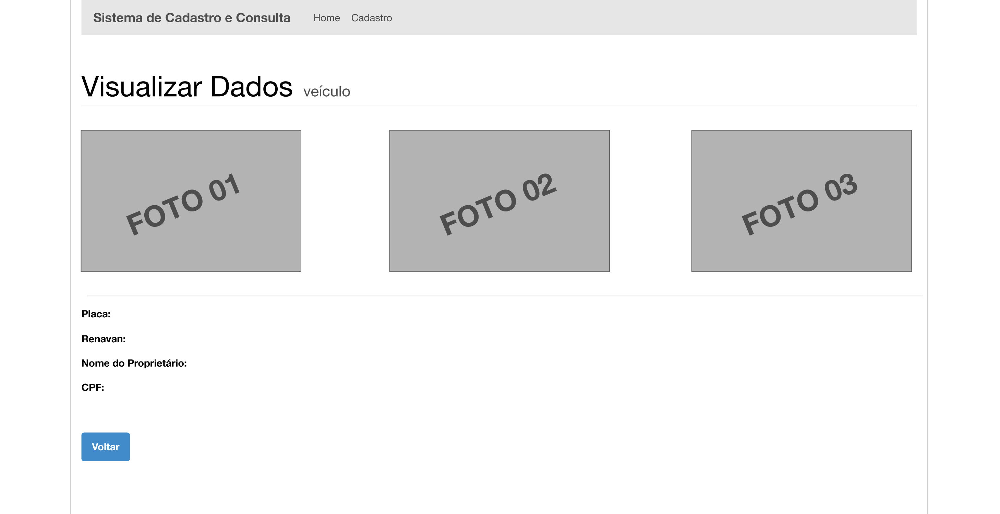

Oportunidade de trabalho no Grupo Oxxy
===========================================

Venha trabalhar na área de tecnologia do Grupo Oxxy. Nosso clima é de extrema colaboração. 

Descrição da Vaga
-------------------------------------------------------
Desenvolvimento e manutenção de sistemas web em MVC e WCF.
Conhecimento nas seguintes linguagens e frameworks: C#, ASP.net MVC, WCF, HTML, CSS, SQL Server.  

Diferencial: Reactivex(RX.NET), TDD, Scrum.

Se você tem interesse em fazer parte de uma equipe multidisciplinar, siga os seguintes passos:
 - Crie um repositório no github ou bitbucket para armazenar a resolução do exercício.
 - Envie um email para trabalheconoscoti@grupooxxy.com.br com seu repositório para nós analisarmos a resolução do exercício.

Exercício de programação: Cadastro de Veículos
-------------------------------------------------------

1 - Crie um site que administre um cadastro de veículos em uma base de dados.

O site consiste basicamente em três telas:

 * **Listar os veículos cadastrados** 
   
    
 * **Formulário para cadastro de veículos**
   (O usuário poderá subir um número ilimitado de fotos)
   
    
 * **Detalhes do veículo** 
   
   
1 - Crie um web service SOAP que liste os veículos cadastrados pelo site podendo filtrar pela placa.
      
As tecnologias que nós recomendamos a utilizar são:
- ASP.NET MVC
- C#
- WCF
- SQL Server

Porém, você poderá realizar o exercício na linguagem de programação de sua preferência. Lembrando que será avaliado a estrutura do código criado, padrões utilizados, testes unitários e qualidade. 
Não precisa se precocupar muito com o layout. 
Qualquer dúvida sobre o exercício envie um email para trabalheconoscoti@grupooxxy.com.br que responderemos para você!

Boa sorte! =)
